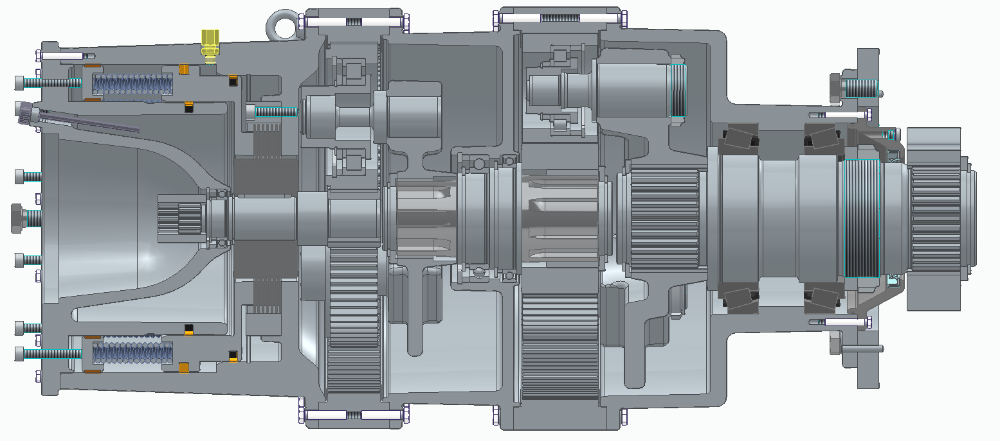

# Ali Basta — Projektportfolio

Maschinenbaustudent (M.Sc.) an der TU Berlin mit Schwerpunkt Konstruktion, Mechatronik und
Automatisierung. Diese Sammlung zeigt zwei Projekte, an denen ich maßgeblich beteiligt war:
eine Getriebekonstruktion aus dem Studium und ein Robotiksystem aus meiner Tätigkeit als
Werkstudent in der Forschung.

📍 Berlin · [LinkedIn](https://www.linkedin.com/in/ali-basta/) · alibasta20@gmail.com

---

## 1. Drehwerkantrieb eines Baggeroberwagens

Zweistufiges Planetengetriebe mit integrierter Lamellen-Haltebremse für einen 30-Tonnen-Kettenbagger.
Hydraulisch angetrieben, Gesamtübersetzung 27,95, Abtriebsmoment 7.715 Nm bei einem Bauraum
von 400 × 400 mm.

**Mein Anteil:** CAD-Aufbau der Gesamtbaugruppe, Zeichnungsableitung, Festlegung von Passungen
und Toleranzen, Stückliste und Montageanleitung.

→ **[Zum Projekt](planetengetriebe/)**

---

## 2. Sprachgesteuertes Robotersystem

Kollaboratives Robotersystem, das natürlichsprachliche Sprachbefehle in Pick-and-Place-Abläufe
eines UR-Roboterarms übersetzt. Entstanden im Rahmen eines Forschungsprojekts zu Cobots in der
Fertigung.

**Mein Anteil:** Konstruktion und 3D-Druck der mechanischen Komponenten, Aufbau des Arbeitsplatzes,
Robotersteuerung, Kamera-/Vision-Anbindung und Koordinatentransformation.

→ **[Zum Projekt](sprachgesteuerter-roboter/)**

---

*Zeugnisse und weitere Unterlagen gerne auf Anfrage.*
