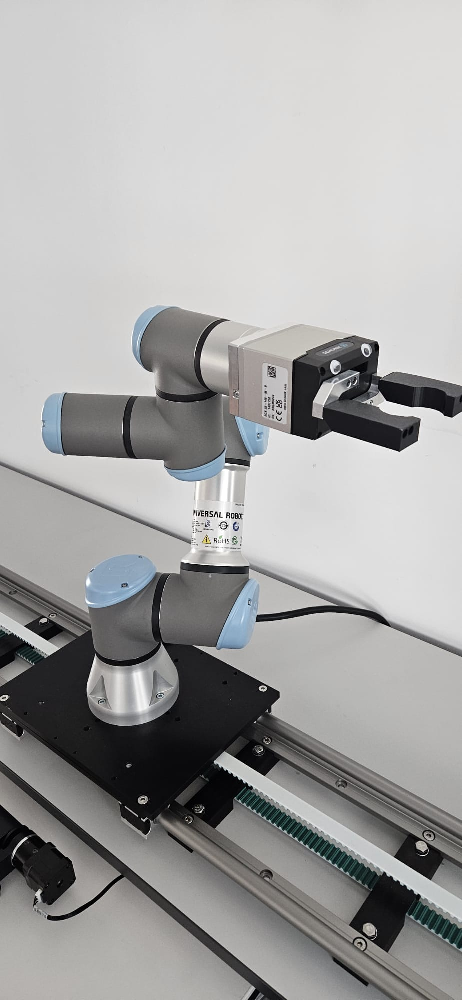

# Sprachgesteuertes Robotersystem zum Sortieren (UR-Roboterarm, Computer Vision, LLM)

Kollaboratives Robotersystem, bei dem ein Mensch einem UR-Roboterarm in natürlicher Sprache und
in beliebiger Sprache Anweisungen geben kann, um Münzen unterschiedlicher Größe und Farbe in die
richtigen Boxen zu sortieren. Entstanden im Rahmen der Forschung zu Cobots, die sicher und
intuitiv neben Menschen in der Fertigung arbeiten, ohne dass die Bedienperson programmieren oder
eine feste Befehlssyntax lernen muss.

> Beispielbefehl: *„Lege 3 kleine grüne Münzen in die grüne Box, nimm dann 2 große orange Münzen
> und 4 blaue Münzen beliebiger Größe von links nach rechts und lege sie alle in die rote Box."*

Befehle dieser Art wurden korrekt verstanden und ausgeführt.

## Demo

Kurzes Video des vollständigen Ablaufs vom Sprachbefehl bis zum Pick-and-Place (Sprachbefehl auf
Arabisch, englische Untertitel):

[**▶ Demo-Video ansehen**](https://www.youtube.com/shorts/WAYct-D2C68)

   
  <em>Arbeitsplatz mit UR-Roboterarm, Kamera und Förderband.</em>

## Funktionsweise

**1. Mechanischer Aufbau** — Arbeitsplatz mit Kamera, Beleuchtung, Förderband und dem
3D-gedruckten Gehäuse des Prüfgates. Die Konstruktion der Bauteile erfolgte in CAD, gefertigt
wurde im FDM-Verfahren.

**2. Sprache → Absicht (LLM)** — Die gesprochene Anweisung wird erfasst und zusammen mit einem
aufgabenspezifischen Prompt an ein LLM übergeben. Das Modell zerlegt die freie Formulierung in
strukturiertes JSON: welche Objekte nach Farbe, Größe und Reihenfolge zu greifen sind und in
welche Box. Unterstützt werden sowohl ein Cloud-LLM (OpenAI API) als auch ein lokal gehostetes
Modell über Ollama, umschaltbar per Umgebungsvariable. Die lokale Variante wurde nach der
Validierung zur bevorzugten Lösung, da sie keine laufenden Kosten pro Anfrage verursacht.

**3. Wahrnehmung (Computer Vision)** — Eine Kamera erfasst den Arbeitsbereich fortlaufend mit
OpenCV und erkennt Position, Farbe und Größe jeder Münze und jeder Box.

**4. Koordinatentransformation** — Zwei orangefarbene Referenzmarker an bekannten Positionen der
Arbeitsplatte spannen das Bezugssystem auf. Aus ihrer Lage im Bild ergibt sich in jedem Frame eine
Ähnlichkeitstransformation (Drehung, Maßstab, Verschiebung) von Pixel- in Millimeterkoordinaten.
Die Kamera muss dadurch nicht exakt fixiert sein. Das Koordinatensystem des Roboters wurde einmalig
auf dieses Plattensystem kalibriert, sodass zur Laufzeit keine Umrechnung zwischen zwei
Bezugssystemen nötig ist.

**5. Ausführung (Robotersteuerung)** — Ein mit dem Roboter verbundener Server erhält die
zugeordneten Objektpositionen per HTTP und reiht sie als Aufträge ein. Der Roboter fährt aus der
Home-Position nacheinander jede Zielmünze an, greift sie, legt sie in die richtige Box und kehrt
in die Bereitschaftsstellung zurück. Da der Arm keine Rückmeldung über abgeschlossene Bewegungen
liefert, meldet sich jedes gesendete URScript am Ende selbst per Socket beim Server zurück.

**6. Qualitätsgate (eigenständige Erweiterung)** — Eine separate Prüfeinheit wurde als Erweiterung
aufgebaut: Nach dem Ablegen auf dem Förderband passiert die Münze ein 3D-gedrucktes Gate mit
Raspberry-Pi-Kamera, die mit demselben Farb- und Formerkennungsansatz prüft, ob die richtige Münze
gegriffen wurde. Der Dienst läuft eigenständig unter Flask und ist nicht in die Sprach-/LLM-Kette
eingebunden; er entstand als Machbarkeitsnachweis für einen nachgelagerten Prüfschritt.

## Mein Beitrag

Das Projekt entstand gemeinsam mit einem Kollegen. Ich war über den gesamten Aufbau hinweg
beteiligt, unter anderem:

- Konstruktion und 3D-Druck der mechanischen Bauteile, einschließlich des Gehäuses für das
  Qualitätsgate
- Physischer Aufbau des Arbeitsplatzes (Kamera, Beleuchtung, Förderband, Gate)
- Auslegung und Umsetzung der Koordinatentransformation zwischen Roboter- und Kamerabezugssystem
- Programmierung der Robotersteuerung, der Kamera- und Vision-Anbindung, der zugehörigen Server
  sowie der LLM-/API-Integration

## Technik

- **LLM:** Übersetzung natürlichsprachlicher Befehle in strukturiertes JSON, austauschbares Backend
  (OpenAI API oder lokal über Ollama), Auswahl per Umgebungsvariable
- **Computer Vision:** Python, OpenCV (Kreiserkennung, Farbklassifikation, Koordinatenverfolgung)
- **Roboter:** Universal-Robots-Arm, Ansteuerung über URScript sowie Dashboard-, Script- und
  Interpreter-Schnittstelle
- **Hardware:** Raspberry-Pi-Kamera, 3D-gedrucktes Gehäuse des Qualitätsgates, Förderband
- **Architektur:** Flask-basierte HTTP-Dienste zwischen Wahrnehmung, Entscheidung (LLM) und
  Ausführung

## Code

Der Ordner [`code/`](code/) enthält eine gekürzte, für die Veröffentlichung neu strukturierte
Auswahl. Sie macht die Architektur nachvollziehbar, ohne den vollständigen Projektcode zu
veröffentlichen.

| Datei | Zweck |
|---|---|
| [`plate_transform.py`](code/plate_transform.py) | Koordinatentransformation Kamera → Arbeitsplatte über zwei Referenzmarker |
| [`coin_detection.py`](code/coin_detection.py) | Kreis- und Farberkennung der Objekte, Auswahl nach Anzahl und Reihenfolge |
| [`command_parser.py`](code/command_parser.py) | Übersetzung des Sprachbefehls in strukturiertes JSON (LLM mit Regex-Fallback) |
| [`robot_control_server.py`](code/robot_control_server.py) | Auftragsverwaltung und Ansteuerung des UR-Arms über URScript |
| [`ollama_client.py`](code/ollama_client.py) | Anbindung des lokal gehosteten Modells |
| [`quality_gate.py`](code/quality_gate.py) | Eigenständiger Prüfdienst am Förderband (Raspberry Pi) |

Die Konfiguration erfolgt vollständig über Umgebungsvariablen, siehe
[`.env.example`](code/.env.example).

---

*Gezeigt wird eine gekürzte Showcase-Version von Code, der im Rahmen eines universitären
Forschungsprojekts entstanden ist. Netzwerkadressen und Zugangsdaten werden ausschließlich über
Umgebungsvariablen gesetzt und sind nicht Teil des Repositories.*
